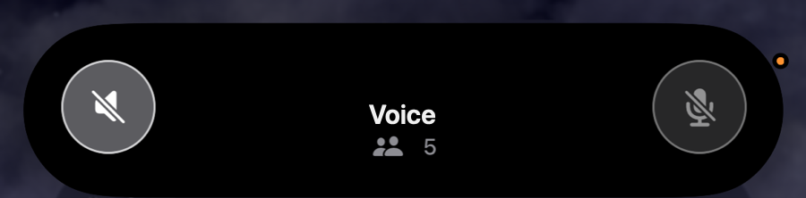
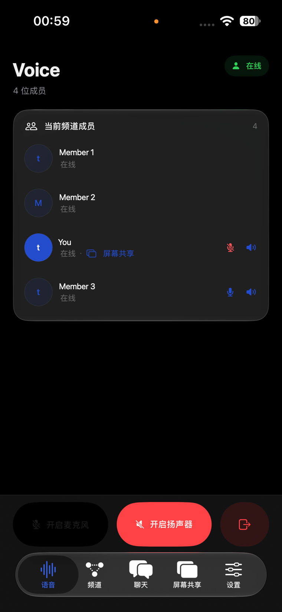
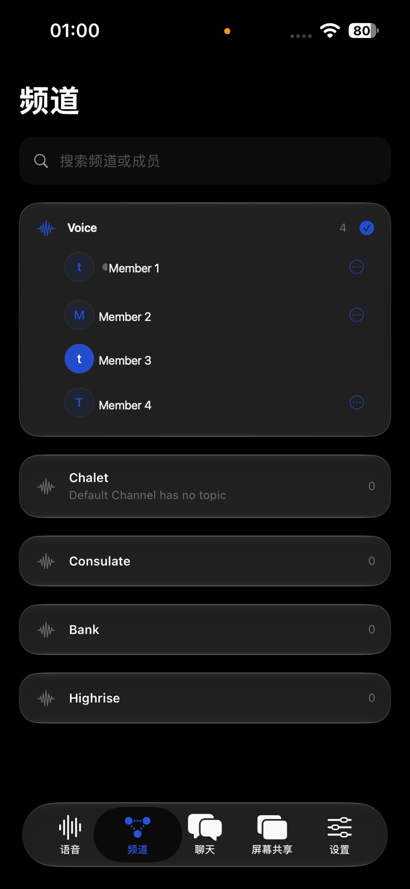
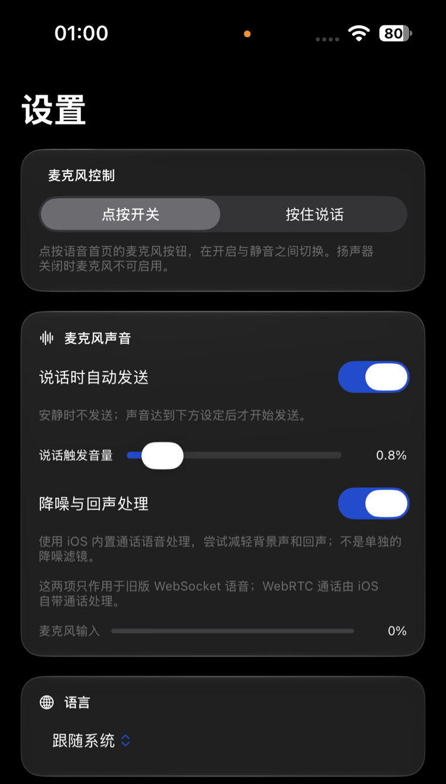

# WebSpeak iOS / iPadOS

> **简体中文** · [English](#english)

## 界面预览 · Screenshots

<p align="center">
  <a href="docs/screenshots/dynamic-island-expanded.png"></a>
  <br />
  <sub>灵动岛展开态 · Expanded Dynamic Island</sub>
</p>

<table>
  <tr>
    <td align="center" valign="top"><strong>语音频道 · Voice channel</strong><br /><a href="docs/screenshots/voice-channel.png"></a></td>
    <td align="center" valign="top"><strong>频道列表 · Channels</strong><br /><a href="docs/screenshots/channel-list.png"></a></td>
    <td align="center" valign="top"><strong>语音设置 · Voice settings</strong><br /><a href="docs/screenshots/settings.png"></a></td>
  </tr>
</table>

<p align="center"><sub>界面预览；语音与屏幕共享的端到端验收状态见 <a href="taskbook/feature-parity.md">功能对照表</a>。 · UI previews only; see the <a href="taskbook/feature-parity.md">feature acceptance checklist</a> for end-to-end status.</sub></p>

## 简体中文

WebSpeak 的原生 Apple 移动客户端，面向 **iPhone 与 iPad**，使用 SwiftUI 构建；不使用 WebView/PWA 作为主界面，也不包含 Mac target。

**当前状态：** 客户端主要功能已接入，正在进行构建验证与设备/网关验收。已在 iPhone 15 / iOS 27.0 验证安装、启动和读取公开网关配置；本机通用 iOS Simulator 与 iOS 设备 SDK Debug 构建通过。入会、实时语音、屏幕共享及后台/蓝牙行为尚未完成端到端验收。逐项状态和验收条件见 [`taskbook/feature-parity.md`](taskbook/feature-parity.md)。

无需自建服务器也可以从连接首页打开 **离线体验 Demo**，浏览语音、频道、聊天、设置和示例灵动岛。演示数据不会连接网关、录音或发送消息；灵动岛展示仅适用于支持该硬件且允许 Live Activities 的设备。

## 工具链

- Xcode 27 / iOS SDK 27
- Deployment target：iOS 17.0；iOS 26 及以上使用系统 Liquid Glass API，较旧系统回退到原生 Material 样式
- Xcode scheme：`WebSpeakIOS`
- WebRTC 依赖固定为 `stasel/WebRTC` `150.0.0`（BSD 3-Clause）

Debug 构建（不签名）：

```sh
xcodebuild -project WebSpeakIOS.xcodeproj -scheme WebSpeakIOS \
  -destination 'generic/platform=iOS Simulator' CODE_SIGNING_ALLOWED=NO build
```

## 设计与架构

- 使用 Apple 原生导航、系统字体、语义色、Dynamic Type 与 VoiceOver；iPhone 使用底部标签导航，iPad 使用侧边栏布局。
- Liquid Glass 只用于导航和关键交互表面，不把内容卡片全部做成玻璃。
- 网关承担 TeamSpeak ServerQuery 与现有控制/共享信令。WebRTC 可用时，语音及屏幕共享媒体通过 WebRTC/ICE P2P 直连；网关关闭 WebRTC 时，语音可回退到兼容的 WebSocket PCM/Opus 路径。
- 可选记住的 TeamSpeak identity 使用 Keychain；一次性网关票据仅保存在内存；不把 TeamSpeak 桌面客户端的本地聊天数据库当作网关历史。
- 遵循 iOS 麦克风、后台音频和屏幕广播权限及生命周期限制，不承诺绕过系统策略实现绝对保活。

架构与设计约束见 [`docs/architecture.md`](docs/architecture.md) 和 [`docs/design-system.md`](docs/design-system.md)。

## License

AGPL-3.0-only，详见 [`LICENSE`](LICENSE)。

---

## English

WebSpeak's native Apple mobile client for **iPhone and iPad**, built with SwiftUI. The main interface does not use a WebView or PWA, and the project has no Mac target.

**Status:** Most client features are integrated; build checks and device/gateway acceptance are in progress. Installation, launch, and public gateway configuration reading were verified on an iPhone 15 running iOS 27.0. Debug builds for the generic iOS Simulator and iOS device SDK also pass locally. Joining a server, live voice, screen sharing, and background/Bluetooth behavior have not yet completed end-to-end acceptance. See [`taskbook/feature-parity.md`](taskbook/feature-parity.md) for per-feature status and acceptance criteria.

No server is required to explore the app: open **Offline Demo** from the connection screen to browse sample voice, channel, chat, settings, and Live Activity views. Demo data never connects to a gateway, records audio, or sends messages. Dynamic Island display requires a supported iPhone with Live Activities enabled.

## Toolchain

- Xcode 27 / iOS SDK 27
- Deployment target: iOS 17.0. The app uses the system Liquid Glass APIs on iOS 26 and later, with native Material styles as a fallback on older releases.
- Xcode scheme: `WebSpeakIOS`
- WebRTC is pinned to `stasel/WebRTC` `150.0.0` (BSD 3-Clause)

Unsigned Debug build:

```sh
xcodebuild -project WebSpeakIOS.xcodeproj -scheme WebSpeakIOS \
  -destination 'generic/platform=iOS Simulator' CODE_SIGNING_ALLOWED=NO build
```

## Design and architecture

- Uses native Apple navigation, system fonts and semantic colors, Dynamic Type, and VoiceOver. iPhone uses a bottom tab bar; iPad uses a sidebar layout.
- Liquid Glass is reserved for navigation and key interactive surfaces rather than being applied to every content card.
- The gateway handles TeamSpeak ServerQuery and the existing control and screen-sharing signaling. When WebRTC is available, voice and screen-sharing media use direct WebRTC/ICE P2P connections. If the gateway disables WebRTC, voice can fall back to the compatible WebSocket PCM/Opus path.
- An optionally remembered TeamSpeak identity is stored in Keychain. One-time gateway tickets remain in memory. The app does not treat a TeamSpeak desktop client's local chat database as gateway history.
- Microphone, background-audio, and screen-broadcast behavior follows iOS permissions and lifecycle rules; the app does not promise to bypass system policies or provide absolute background persistence.

See [`docs/architecture.md`](docs/architecture.md) and [`docs/design-system.md`](docs/design-system.md) for architecture and design constraints.

## License

AGPL-3.0-only. See [`LICENSE`](LICENSE).
